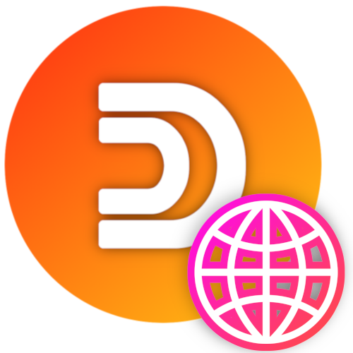

<!--
*** Official Duino-Coin website README
*** by Kristian, 2021
-->

## Duino-Coin Website

This branch of the Duino-Coin repository contains the code for the Duino-Coin website located at [https://duinocoin.com](https://duinocoin.com).

## License

The Duino-Coin website is distributed under the MIT License. See the `LICENSE` file for more information.

## Website maintainers
* [@Revox](https://github.com/revoxhere/) - kristian@beyondcoin.io (Duino-Coin Founder)
* [@Tech1k](https://github.com/Tech1k/) - kristian@beyondcoin.io (Lead Webmaster and DUCO Developer)

Also, big thanks to all the [contributors](https://github.com/revoxhere/duino-coin/graphs/contributors) that helped with the Duino-Coin website.

Website Link: [https://duinocoin.com](https://duinocoin.com)
