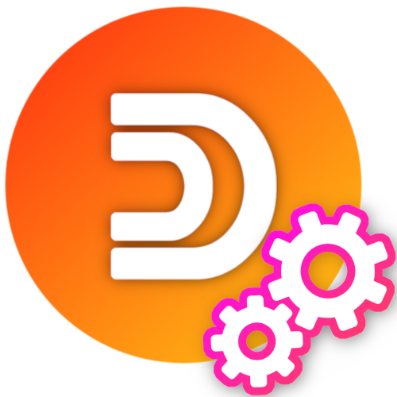

##

##

    

    <h1>Duino-Coin Master Server</h1>

This branch of the Duino-Coin repository contains the source code of the master-server and documentation for it.

## Contributing
Contributions are welcome! If you'd like to help improve Duino-Coin, please check out our [Contribution Guide](CONTRIBUTING.md).

## License
This project is licensed under the MIT License - see the [LICENSE](LICENSE) file for details.

## Branding

We suggest using these colors in creating DUCO-Related apps:

### Branding colors

* White accent: `#fafafa` ■
* Orange accent: `#ff4112` ■
* Sun yellow accent: `#ffb412` ■
* Magenta accent: `#f31291` ■
* Dark accent: `#121212` ■

Gradient variations of the colors above are a welcome touch.

#### GUI colors
* Background: `#121212` (Dark) ■ or `#fffdee` (Light) ■
* Font color: `#fffdee` (Dark) ■ or `#0f0f0f` (Light) ■

### Icons

| | | |
|:---:|:---:|:---:|
|  |  |  |
|  |  |  |

  

More resources available in the [Resources folder](https://github.com/revoxhere/duino-coin/tree/master/Resources)