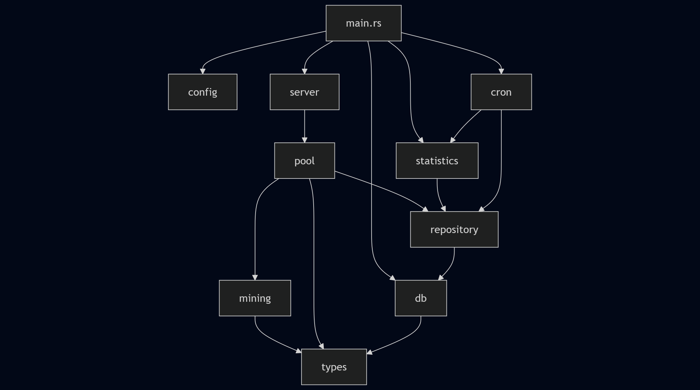

## File Structure

```
master_server/
├── docs/
├── src/
│   ├── cli/
│   ├── config/
│   ├── db/
│   ├── mining/
│   ├── pool/
│   ├── server/
│   ├── repository/
│   ├── statistics/
│   ├── cron/
│   ├── types/
│   └── main.rs
```


---

## Module Overview

| Module           | Responsibility |
|-----------------|----------------|
| `cli`            | Command-line interface to manage the server |
| `config`         | Loading and managing configuration (TOML) |
| `db`             | PostgreSQL connection, migrations |
| `mining`         | Difficulty calculation, rewards, and share verification |
| `pool`           | Pool management: login, work synchronization, logout |
| `server`         | TCP server |
| `repository`     | Data access abstraction, interacts with `db` |
| `statistics`     | Global pool and per-user statistics |
| `cron`           | Scheduled tasks: reward distribution, statistics cleanup |
| `types`          | Data types, structs, enums, and constants |
| `main.rs`        | Initializes configuration, logging, database, and starts server and cron jobs |

---

## Dependency Diagram

